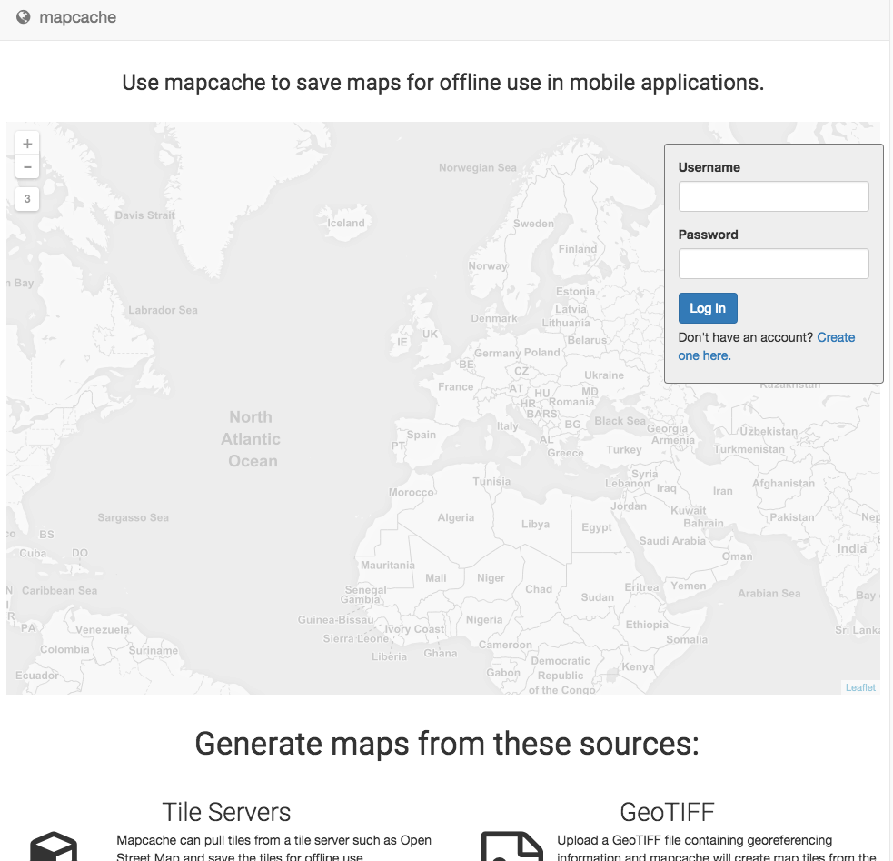

mapcache
============

mapcache-server is built with Node.js and MongoDB which allows users to create portable maps from various sources.

Currently supported input formats:
* Tile Servers
* WMS Servers
* GeoTIFF
* MBTiles

Currently supported output formats:
* XYZ/TMS
* GeoPackage
* MBTiles

[Installation](#installation)



# Installation

## Install Homebrew
```ruby -e "$(curl -fsSL https://raw.githubusercontent.com/Homebrew/install/master/install)"```

## Install Dependencies

### Node.js
```brew install node```

### MongoDB
```brew install mongo```

### GDAL
```brew install libtiff```
```brew install gdal --with-libtiff```

### MBUtil

```git clone git://github.com/mapbox/mbutil.git
cd mbutil
sudo python setup.py install
mb-util```

# Linux Install

TODO Format this to be readable


Install mongo 2.6 (these instructions haven't been verified yet)
vi /etc/yum.repos.d/mongodb-org-2.6.repo
add this:
[mongodb-org-2.6]
name=MongoDB 2.6 Repository
baseurl=http://downloads-distro.mongodb.org/repo/redhat/os/x86_64/
gpgcheck=0
enabled=1
sudo yum install -y mongodb-org


Need node 0.12
curl -o- https://raw.githubusercontent.com/creationix/nvm/v0.25.4/install.sh | bash
nvm install 0.12
nvm use 0.12
nvm alias default node
Do the above on both the ec2-user and the root user

install gdal (as root in home directory)

tar -xf MrSID_DSDK-9.1.0.4045-linux.x86-64.gcc44.tar.gz

wget http://download.osgeo.org/gdal/1.11.2/gdal-1.11.2.tar.gz
tar -xzvf gdal-1.11.2.tar.gz

// don’t think you need the following lines
export CC="gcc -fPIC"
export CXX="g++ -fPIC"

yum install tbb
 
cd gdal-1.11.2

./configure --with-mrsid=/root/MrSID_DSDK-9.1.0.4045-linux.x86-64.gcc44/Raster_DSDK \
              --with-mrsid_lidar=/root/MrSID_DSDK-9.1.0.4045-linux.x86-64.gcc44/Lidar_DSDK \
              --with-jp2mrsid

make
make install
 
// if you didn’t change them before don’t change them back
export CC="gcc"
export CXX="g++"
 
export LD_LIBRARY_PATH=/usr/local/lib:${LD_LIBRARY_PATH}

cp MrSID_DSDK-9.1.0.4045-linux.x86-64.gcc44/Lidar_DSDK/lib/liblti_lidar_dsdk.so /usr/local/lib/.
cp MrSID_DSDK-9.1.0.4045-linux.x86-64.gcc44/Raster_DSDK/lib/libltidsdk.so* /usr/local/lib/.

Need to install proj4

wget http://download.osgeo.org/proj/proj-4.8.0.tar.gz
wget http://download.osgeo.org/proj/proj-datumgrid-1.5.tar.gz
tar xzf proj-4.8.0.tar.gz
cd proj-4.8.0/nad
tar xzf ../../proj-datumgrid-1.5.tar.gz
cd ..
./configure
make
sudo make install

yum install xz-utils

Install Cairo - instructions from here were changed to work: https://github.com/Automattic/node-canvas/wiki/Installation---Amazon-Linux-AMI-(EC2)
sudo yum erase cairo
export PKG_CONFIG_PATH='/usr/local/lib/pkgconfig'  
export LD_LIBRARY_PATH='/usr/local/lib':$LD_LIBRARY_PATH
go get libpng http://sourceforge.net/projects/libpng/files/libpng16/1.6.17/libpng-1.6.17.tar.gz/download
tar xzf libpng-1.6.17.tar.gz
cd libpng-1.6.17
./configure --prefix=/usr/local
make
sudo make install


cd ~
curl http://www.ijg.org/files/jpegsrc.v8d.tar.gz -o jpegsrc.tar.gz
tar -zxf jpegsrc.tar.gz && cd jpeg-8d/
./configure --disable-dependency-tracking --prefix=/usr/local
make
sudo make install
cd ~
curl http://www.cairographics.org/releases/pixman-0.28.2.tar.gz -o pixman.tar.gz
tar -zxf pixman.tar.gz && cd pixman-0.28.2/  
$ ./configure --prefix=/usr/local
$ make
$ sudo make install
// this may not work
// if not use this command.  Cairo will fail to configure itself because pixman is not present
sudo yum install -y pixman pixman-devel


// maybe don’t need this or try yum install freetype
cd ~
curl http://public.p-knowledge.co.jp/Savannah-nongnu-mirror//freetype/freetype-2.4.11.tar.gz -o freetype.tar.gz
$ tar -zxf freetype.tar.gz && cd freetype-2.4.11/  
$ ./configure --prefix=/usr/local
$ make
$ sudo make install

curl http://cairographics.org/releases/cairo-1.12.14.tar.xz -o cairo.tar.xz  
$ tar -xJf cairo.tar.xz && cd cairo-1.12.14/  
$ ./configure --disable-dependency-tracking --without-x --prefix=/usr/local
$ make
$ sudo make install

sudo yum install giflib-devel

do this in the folder that you get the source into
npm install gdal --build-from-source --shared_gdal

```git clone git://github.com/mapbox/mbutil.git
cd mbutil
sudo python setup.py install
mb-util```


Install posgres and postgis

sudo su -
adduser postgres

yum install postgresql postgresql-server postgresql-devel postgresql-contrib postgresql-docs


Install postgis
sudo su -
mkdir postgis
cd postgis


yum install geos-devel
yum install libxml2-devel
yum install json-c-devel

cd ~/postgis/
wget http://download.osgeo.org/postgis/source/postgis-2.1.7.tar.gz
tar zxvf postgis-2.1.7.tar.gz
cd postgis-2.1.7
./configure --with-geosconfig=/usr/local/bin/geos-config
make
make install

sudo su
echo /usr/local/lib >> /etc/ld.so.conf
exit
sudo ldconfig

service postgresql initdb
service postgresql start

su postgres -

psql

CREATE DATABASE mapcache;

CREATE SCHEMA mapcache;
CREATE EXTENSION postgis;
CREATE EXTENSION postgis_topology;
CREATE EXTENSION fuzzystrmatch;
CREATE EXTENSION postgis_tiger_geocoder;

alter user postgres password 'postgres';

edit /var/lib/pgsql/data/pg_hba.conf and set the connection confgurations from ident to trust


cd ~
wget --no-cookies --no-check-certificate --header "Cookie: gpw_e24=http%3A%2F%2Fwww.oracle.com%2F; oraclelicense=accept-securebackup-cookie" "http://download.oracle.com/otn-pub/java/jdk/7u79-b15/jdk-7u79-linux-x64.rpm"

sudo yum localinstall jdk-7u79-linux-x64.rpm


## Contact

If you have any questions, or would like to get in touch, contact Ben Tuttle.

## License
